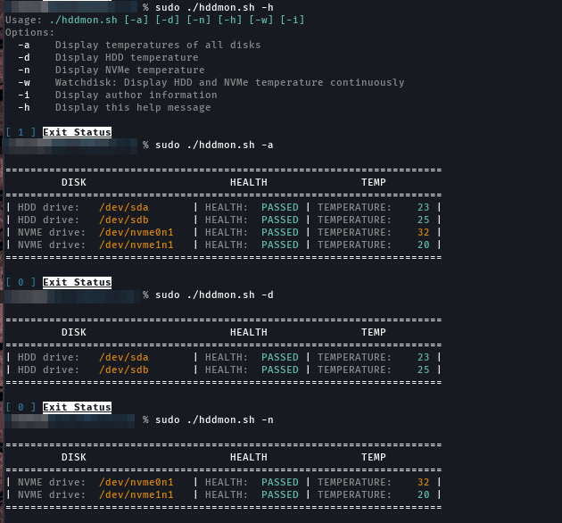

### Installation / Download


## Overview 
This script monitors disk health and temperature using smartctl.

  
### Clone the Repository 

```bash
git clone https://github.com/Im0nk3yar0und/hddmon.git cd hddmon
```

### Make the Script Executable
```bash
chmod +x hddmon.sh
sudo ./hddmon.sh [options]
```

### Options

- For a list of available options, run:
```bash
sudo ./hddmon.sh -h
```
- If no options are provided, the script will run the default behavior, which is equivalent to using the `-a` option. This will display temperatures of all disks.


```bash
-a: Display temperatures of all disks.
-d: Display HDD temperature.
-n: Display NVMe temperature.
-w: Watchdisk: Display HDD and NVMe temperature continuously.
-i: Display author information.
-h: Display help message.
```

### Examples
1. Run default behavior:
```bash
./hddmon.sh -a
```

2. Display HDD temperature:
```bash
./hddmon.sh -d
```

3. Display NVMe temperature:
```bash
./hddmon.sh -n
```

4. Watchdisk: Display HDD temperature continuously:
```bash
./hddmon.sh -w
```

5. Display help message:
```bash
./hddmon.sh -h
```





### Author Information
- Author:                 Im0nk3yar0und
- Date:                   2024-01-31
- Description:            Disk health and temperature monitoring script using smartctl.


### License
MIT opensource licence, free to keep or change.


### Disclaimer

**Use at Your Own Risk:**
This script and associated documentation are provided as-is without any warranty. 
The author is not responsible for any damage or loss of data caused by the use of this script. 
It is recommended to review and understand the script's functionality before running it, and to test it in a safe environment.

**Prerequisites:**
Ensure that you have read and understood any prerequisites mentioned in the documentation. 
Running the script without meeting these requirements may lead to unexpected behavior.

**Backup:**
It is highly recommended to create a backup of your data before using this script. 
In the event of unintended consequences, having a backup ensures that you can restore your system to a previous state.

By using this script, you acknowledge that you have read, understood, and agreed to these terms.

**Thank you.**
im0nk3yar0und
